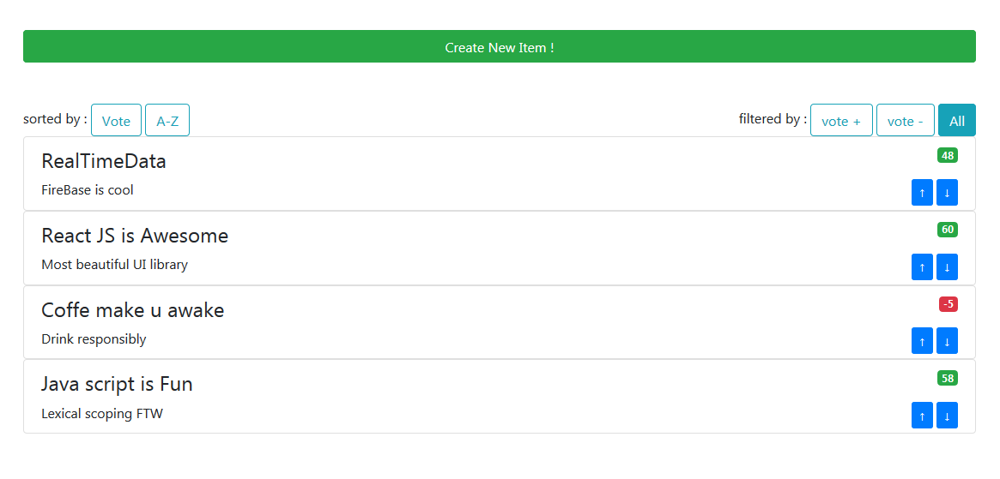
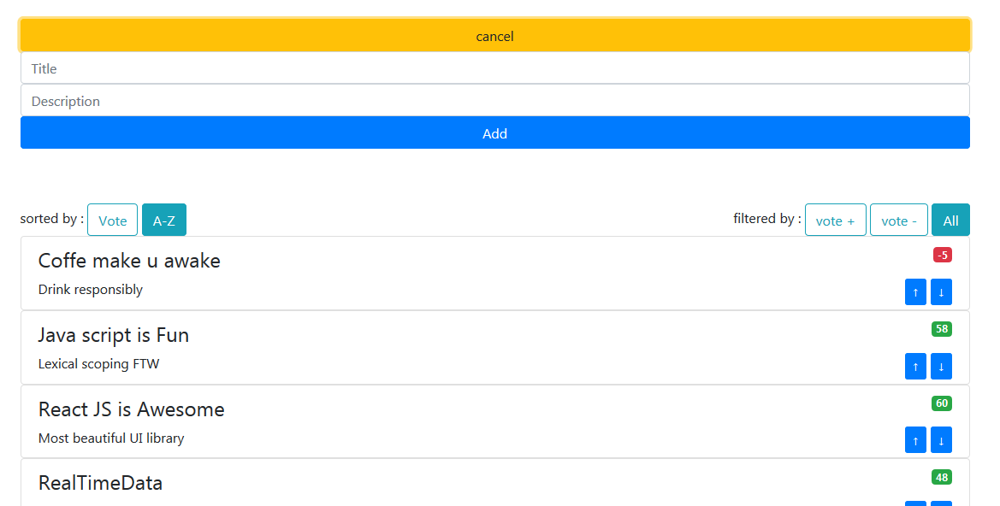
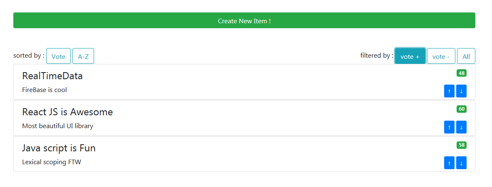

# Vote-it

Vote-it is a react application for learning React JS, that provides a list of topics (items) to vote on in a simple manner and allow also users to add new items to the list and vote on existed ones.  
The first part contains preset items in the state directly, thats only for understand the logic of the app and to get started with react, however in the second part we get all items from firebase database, any added item will be stored automatically on firebase, then listed with the others items, what make our application a real time apps

## Getting Started

This project was bootstrapped with [Create React App](https://github.com/facebookincubator/create-react-app). 

### Prerequisites

Make sure node is installed, if is not go to node js and download latest version

In part 2 we use Firebase database to store items added by users and to fetch them on loading page, to get startted with firebase take a look at :[google firebase docs](https://firebase.google.com/docs/)

and here a simple and interesting tuto : [firebae tuto](https://www.codementor.io/yurio/all-you-need-is-react-firebase-4v7g9p4kf)
### Installing

clone this repo and cd to vote-it folder
afte that type npm install to install all required dependencies
here you are : 
``` 
git clone https://github.com/aMahdaoui/vote-it.git 
cd vote-it
npm install 
npm start
```
then go to : http://localhost:3000

### ScreenShots

Part 1 : topics getted  app state

 
 
 
 

part 2 topics retrieved from firebase database


## Authors

* **Mahdaoui Abdessadeq** - *Initial work*  
  
